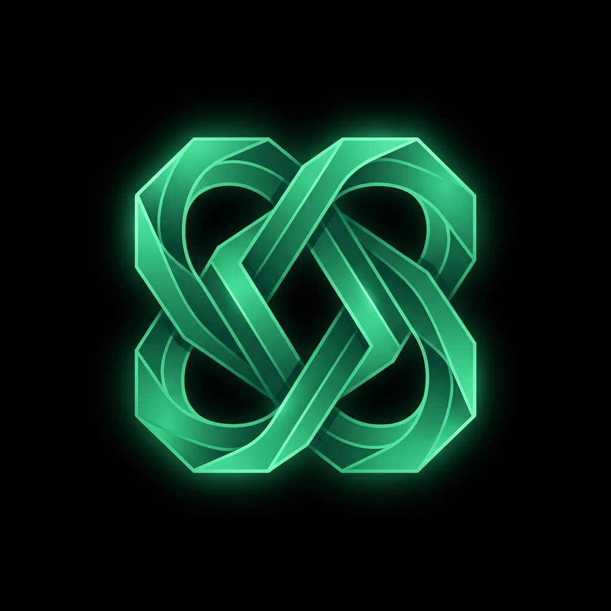

  
  
  # José Eugênio | Landing Pages Que Convertem
  
  **Designer e Desenvolvedor de Landing Pages de Alta Performance**

---

## ✦ Sobre o Portfólio

Este é o meu espaço digital, construído com foco absoluto em **estratégia, conversão e design premium**. Não desenvolvo apenas sites esteticamente agradáveis; construo ativos digitais projetados para alavancar negócios.

Meu processo une uma forte estética de UI (inspirada em produtos *High-End* como Linear, Framer e Vercel) com tecnologias de ponta. O resultado são páginas rápidas, polidas e perfeitamente otimizadas para guiar visitantes até a tomada de ação.

## ✦ Especialidades

- 🎯 **Páginas de Captura de Leads:** Estruturas focadas em maximizar a conversão de tráfego orgânico e pago.
- 🚀 **Páginas de Lançamento:** Design imersivo que gera antecipação e validação de produtos.
- 💻 **Landing Pages para SaaS:** Experiências desenhadas para alavancar *signups* e solicitações de demonstração.
- 📈 **Otimização de Conversão (CRO):** Redesign focado inteiramente em aumentar as taxas de fechamento.

## ✦ A Tecnologia 

O portfólio não possui apenas um design minimalista (Dark Mode + Glassmorphism). Ele é uma vitrine do meu padrão de desenvolvimento técnico:

- **Next.js 15 & React:** A infraestrutura de renderização mais poderosa do mercado.
- **Framer Motion:** Animações e interações fluídas, desenhadas para rodar a suaves 60FPS.
- **Tailwind CSS v4:** Padronização visual em qualquer dispositivo, desde monitores Ultrawide até smartphones.
- **SEO Perfeito & Web Vitals:** Implementação avançada de OpenGraph Dinâmico (`next/og`), rastreabilidade via `sitemap/robots`, e Schema.org (JSON-LD) para dominância em motores de busca.

## ✦ O Processo

01. **Descoberta:** Imersão no seu modelo de negócio, público-alvo e métricas atuais.
02. **Estratégia:** Definição da hierarquia de informações e do fluxo de conversão ideal.
03. **Design & Code:** Transformando lógica em interfaces "Premium" com código limpo e sustentável.
04. **Lançamento:** Entrega com nota máxima (100/100) no Google Lighthouse.

## ✦ Vamos Trabalhar Juntos?

Me conte um pouco sobre o seu próximo projeto e receba uma proposta estratégica.

- 📱 [**WhatsApp**](https://wa.me/5561998661866) (Retorno Imediato)
- 📧 [**E-mail**](mailto:soujoseeugenio@gmail.com)
- 🎨 [**Behance**](https://www.behance.net/joseugnio3)
- 💻 [**GitHub**](https://github.com/neveshardd)

 

  Projetado e desenvolvido com obsessão por detalhes por José Eugênio.

